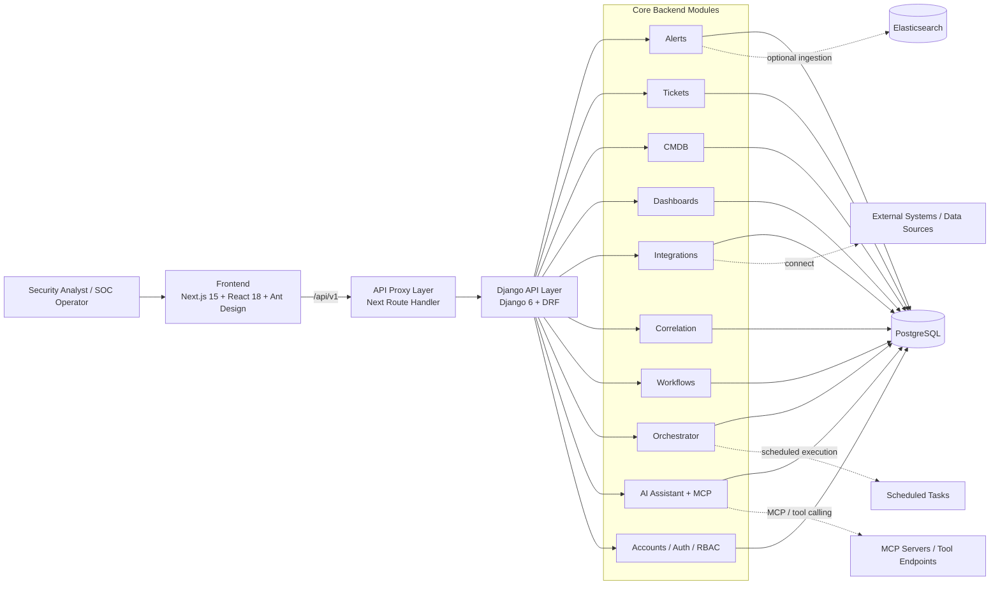

# ECHO-SOC-Platform

ECHO-SOC-Platform 是一个面向安全运营中心（SOC）的 AI-native 安全运营平台，围绕“告警汇聚、事件研判、工单协同、资产关联、流程编排、AI 辅助分析”构建统一工作台。

该项目采用前后端分离架构：**Next.js + React** 提供运营控制台，**Django + Django REST Framework** 提供 API 与业务编排能力，**PostgreSQL** 作为核心数据存储，并支持将 **Elasticsearch** 作为外部告警源接入。

---

## 1. 产品定位

ECHO-SOC-Platform 旨在解决 SOC 日常工作中常见的碎片化问题：

- 告警来自多个系统，缺乏统一入口
- 工单、资产、告警、处置流程彼此割裂
- 人工调查链路长，复用经验困难
- 安全分析师需要在多个系统之间频繁切换
- LLM 能力难以安全、可控地嵌入安全运营流程

平台将安全运营核心对象统一在一个产品内：

- **Alerts**：告警接入、缓存、检索与展示
- **Tickets**：事件/工单管理与协同处理
- **CMDB**：资产信息管理与上下文关联
- **Dashboards**：运营看板与可视化视图
- **Integrations**：外部系统连接与配置
- **Correlation**：规则与关联分析能力
- **Workflows / Orchestrator**：自动化流程与任务调度
- **AI Assistant**：面向安全场景的智能分析与 MCP 工具接入

---

## 2. 核心能力

### 安全运营能力
- 统一告警入口与列表管理
- 工单流转与处置记录沉淀
- 资产维度上下文补全
- 看板化安全态势展示
- 关联规则与调查辅助

### 自动化能力
- 工作流编排与接口调用
- 定时任务调度与执行记录
- 面向工单/告警的自动化处置链路

### AI 能力
- 内置 AI Assistant 对话接口
- MCP 风格工具清单与 JSON-RPC 接入
- 面向 ticket 上下文、相似案例、资产查询、可观测对象提取的能力封装

### 平台能力
- Token 鉴权
- OTP 登录/验证接口
- PostgreSQL 持久化存储
- Docker Compose 与 Kubernetes 部署支持

---

## 3. 系统架构图



### 架构说明

1. **前端层**：基于 Next.js App Router 构建控制台 UI，承担页面展示、交互编排与 API 转发。  
2. **API 层**：Django + DRF 提供统一业务 API，覆盖认证、告警、工单、资产、工作流、AI 能力等模块。  
3. **业务层**：以 Django apps 形式组织领域能力，便于独立演进与权限控制。  
4. **数据层**：PostgreSQL 是系统主存储；Elasticsearch 作为可选告警输入源。  
5. **智能层**：AI Assistant 提供对话与工具调用能力，并暴露 MCP 风格接口。  
6. **自动化层**：Orchestrator 与 Workflows 提供定时执行、流程编排与审计记录能力。  

---

## 4. 技术栈

### Frontend
- Next.js 15
- React 18
- Ant Design 5
- Axios
- React Flow
- ECharts / Ant Design Charts

### Backend
- Django 6
- Django REST Framework
- DRF Token Authentication
- django-scheduled-tasks
- croniter
- gunicorn
- WhiteNoise

### Data / Infrastructure
- PostgreSQL 16
- Elasticsearch（可选）
- Docker / Docker Compose
- Kubernetes
- GitHub Actions

---

## 5. 主要模块

| 模块 | 职责 |
| --- | --- |
| `accounts` | 认证、登录、OTP、权限与访问控制 |
| `alerts` | 告警同步、缓存、展示与检索 |
| `tickets` | 事件/工单管理与联动处置 |
| `cmdb` | 资产数据管理与查询 |
| `dashboards` | 可视化看板与运营视图 |
| `integrations` | 外部系统接入与连接配置 |
| `correlation` | 规则关联与调查辅助 |
| `workflows` | 工作流定义与执行接口 |
| `workflow_interfaces` | 工作流接口适配层 |
| `orchestrator` | 定时任务、调度、执行记录 |
| `ai_assistant` | AI 对话、MCP、工具路由与上下文处理 |

---

## 6. 仓库结构

```text
ECHO-SOC-Platform/
├── backend/                  # Django 后端
│   ├── accounts/
│   ├── alerts/
│   ├── ai_assistant/
│   ├── cmdb/
│   ├── correlation/
│   ├── dashboards/
│   ├── integrations/
│   ├── orchestrator/
│   ├── tickets/
│   ├── workflow_interfaces/
│   ├── workflows/
│   └── siem_project/         # Django project settings / urls
├── frontend/                 # Next.js 前端
│   └── src/
│       ├── app/
│       ├── components/
│       ├── modules/
│       ├── services/
│       └── lib/
├── k8s/                      # Kubernetes 部署清单
├── docker-compose.dev.yml    # 开发环境编排
├── docker-compose.prod.yml   # 生产环境编排
├── env.example               # 环境变量模板
└── makefile                  # 常用命令封装
```

---

## 7. 快速开始

### 7.1 环境要求
- Docker
- Docker Compose
- GNU Make

推荐优先使用 Docker Compose 进行本地启动。

### 7.2 配置环境变量

复制环境变量模板：

```bash
cp env.example .env
```

至少需要配置以下项目：

```env
SECRET_KEY=replace-with-a-strong-secret
DEBUG=True
ALLOWED_HOSTS=localhost,127.0.0.1,backend

POSTGRES_DB=siem_db
POSTGRES_USER=siem_user
POSTGRES_PASSWORD=siem_password
POSTGRES_HOST=db
POSTGRES_PORT=5432

BACKEND_ORIGIN=http://backend:8000
```

如需启用外部 Elasticsearch 告警接入，可继续配置：

```env
ES_HOST=http://localhost:9200
ES_USERNAME=elastic
ES_PASSWORD=your-es-password
```

---

## 8. 本地运行

### 8.1 开发环境启动

```bash
make build-dev
```

对应编排文件：`docker-compose.dev.yml`

默认访问地址：

- Frontend: `http://localhost:3000`
- Backend API: `http://localhost:8000`
- PostgreSQL: `localhost:5432`

### 8.2 生产方式启动

```bash
make build-prod
```

对应编排文件：`docker-compose.prod.yml`

默认访问地址：

- Frontend: `http://localhost`
- Backend API: `http://localhost:8000`

### 8.3 常用命令

```bash
make logs-dev
make logs-prod
make restart-dev
make restart-prod
make redeploy-dev
make redeploy-prod
```

---

## 9. API 与访问方式

后端统一使用 `/api/v1/` 作为版本化 API 前缀，主要包括：

- `/api/v1/auth/`：登录、登出、注册、OTP
- `/api/v1/alerts/`：告警能力
- `/api/v1/tickets/`：工单能力
- `/api/v1/cmdb/`：资产能力
- `/api/v1/workflows/`：工作流能力
- `/api/v1/integrations/`：集成配置与测试
- `/api/v1/ai-assistant/`：AI 助手与工具配置
- `/api/v1/mcp/`：MCP JSON-RPC 与工具清单接口

前端通过 Next.js 路由处理器代理 `/api/v1/*` 请求到后端服务，从而统一浏览器侧访问路径。

---

## 10. AI Assistant 与 MCP 能力

平台内置 AI Assistant 模块，面向安全运营场景提供智能辅助能力，包括：

- 对话式分析入口
- 基于 ticket 的上下文查询
- 相似案例检索
- CMDB 资产查询
- 可观测对象提取
- 外部 MCP Server 的注册、启动、停止与监控

这使得平台不仅是一个传统 SOC 控制台，也具备将 AI 分析能力嵌入调查与处置流程的基础设施。

---

## 11. 调度与自动化说明

平台包含 `orchestrator` 和 `workflows` 两类自动化能力：

- `workflows`：定义流程与接口调用逻辑
- `orchestrator`：定义计划任务、执行记录和调度过程

当前默认任务后端为 **Django in-process immediate backend**。这意味着任务会在应用进程内触发执行。对于更高并发、隔离执行或分布式任务场景，建议后续替换为独立任务后端。

---

## 12. 部署说明

### Docker Compose
- `docker-compose.dev.yml`：本地开发环境
- `docker-compose.prod.yml`：生产化容器运行方式

### Kubernetes
`k8s/` 目录提供基础部署清单：

- `k8s/backend-deploy.yaml`
- `k8s/frontend-deploy.yaml`
- `k8s/postgres-deploy.yaml`

适合作为容器化部署和云环境落地的基础模板。

---

## 13. 安全与工程化

项目已具备一定工程化基础：

- 基于 Token 的 API 鉴权
- OTP 登录接口支持
- 静态资源由 WhiteNoise 提供
- GitHub Actions 工作流支持镜像构建与安全扫描
- 支持容器化与 Kubernetes 部署

对于生产环境，建议额外落实：

- 强随机 `SECRET_KEY`
- 精确配置 `ALLOWED_HOSTS` 与 `CSRF_TRUSTED_ORIGINS`
- 使用专用邮件网关承载 OTP 邮件发送
- 为数据库、对象存储、日志与审计链路增加备份与监控
- 为 AI/MCP 能力配置访问边界、审计与最小权限策略

---

## 14. 适用场景

ECHO-SOC-Platform 适用于以下场景：

- 企业内部 SOC 平台建设
- MSSP / 安全服务团队的统一工作台
- 安全运营自动化与流程编排项目
- 需要把 AI 能力嵌入安全研判链路的产品原型或业务平台

---

## 15. 许可证

本项目许可证信息见 `LICENSE.md`。

在将本项目用于生产、商业分发或托管服务前，建议先审阅许可证中的具体限制与适用范围。
