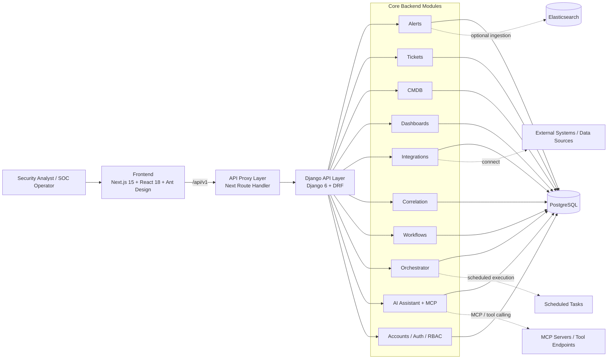

# ECHO-SOC-Platform

This repository contains the ECHO-SOC-Platform — an AI-native Agentic Security Operations Center (SOC) platform focused on unifying alerts ingestion, incident investigation, ticket collaboration, asset correlation, workflow orchestration, and AI-assisted analysis.

The project uses a separated frontend/backend architecture: the frontend is built with Next.js + React to provide the operator console, the backend uses Django + Django REST Framework to provide APIs and orchestration, and PostgreSQL is the primary data store. Elasticsearch is optionally supported as an external alert source.

---

## 1. Product Positioning

The platform consolidates core SOC objects into one product with open-source solutions:

- Alerts: alert ingestion, caching, search, and display
- Tickets: incident/ticket management and collaboration
- CMDB: asset inventory and contextual linking
- Dashboards: operational dashboards and visualizations
- Integrations: connectors and external configuration
- Correlation: correlation rules and analysis
- Workflows / Orchestrator: automation and scheduling
- AI Assistant: security-focused intelligent analysis and MCP tool integration

---

## 2. Core Capabilities

### Security Operations
- Unified alert ingestion and paginated lists
- Ticket lifecycle and activity history
- Asset-context enrichment
- Dashboard-based operational views
- Correlation rules and investigative helpers

### Automation
- Workflow orchestration and API-driven calls
- Scheduled task execution and audit logs
- Automation chains for tickets/alerts

### AI Features
- Built-in AI Assistant conversational interface
- MCP-style tool registry and JSON-RPC connector
- Ticket-context queries, similar-case retrieval, CMDB queries, and observable extraction

### Platform Capabilities
- Token-based authentication
- OTP login/verification endpoints
- PostgreSQL persistence
- Docker Compose and Kubernetes deployment manifests

---

## 3. System Architecture Diagram



### Architecture Notes

1. Frontend: Built with Next.js App Router; handles pages, UI composition, and API proxying.
2. API Layer: Django + DRF provide unified business APIs (auth, alerts, tickets, CMDB, workflows, AI).
3. Business Layer: Domain features are organized into Django apps for independent evolution and RBAC.
4. Data Layer: PostgreSQL is the primary datastore; Elasticsearch is an optional alert source.
5. Intelligence Layer: AI Assistant offers conversation and tool-call capabilities, exposing MCP-style interfaces.
6. Automation Layer: Orchestrator and Workflows provide scheduled execution, orchestration, and audit trails.

---

## 4. Tech Stack

### Frontend
- Next.js 15
- React 18
- Ant Design 5

### Backend
- Django 6
- Django REST Framework
- DRF Token Authentication

### Data / Infrastructure
PostgreSQL 16 (optional)
Elasticsearch (optional)
---

## 5. Main Modules

| Module | Responsibility |
| --- | --- |
| `accounts` | Authentication, login, OTP, and permissions |
| `alerts` | Alert ingestion, caching, display, and search |
| `ai_assistant` | AI conversation, MCP tooling, and context routing |
| `cmdb` | Asset management and queries |
| `dashboards` | Visualization dashboards and views |
| `integrations` | External connectors and configuration |
| `correlation` | Correlation rules and investigative helpers |
| `workflows` | Workflow definitions and execution API |
| `workflow_interfaces` | Workflow interface adapter layer |
| `orchestrator` | Scheduled tasks, execution, and records |
| `tickets` | Incident/ticket management and related workflows |

---

## 6. Repository Layout

```text
ECHO-SOC-Platform/
├── backend/                  # Django backend
│   ├── accounts/
│   ├── alerts/
│   ├── ai_assistant/
│   ├── cmdb/
│   ├── correlation/
│   ├── dashboards/
│   ├── integrations/
│   ├── orchestrator/
│   ├── tickets/
│   ├── workflow_interfaces/
│   ├── workflows/
│   └── siem_project/         # Django project settings / urls
├── frontend/                 # Next.js frontend
│   └── src/
│       ├── app/
│       ├── components/
│       ├── modules/
│       ├── services/
│       └── lib/
├── k8s/                      # Kubernetes manifests
├── docker-compose.dev.yml    # Dev compose
├── docker-compose.prod.yml   # Prod compose
├── env.example               # Env template
└── makefile                  # Helper targets
```

---

## 7. Quick Start

### 7.1 Requirements
- Docker
- Docker Compose
- GNU Make

We recommend using Docker Compose for local development.

### 7.2 Configure environment variables

Copy the environment template:

```bash
cp env.example .env
```

Minimum required values:

```env
SECRET_KEY=replace-with-a-strong-secret
DEBUG=True
ALLOWED_HOSTS=localhost,127.0.0.1,backend

POSTGRES_DB=siem_db
POSTGRES_USER=siem_user
POSTGRES_PASSWORD=siem_password
POSTGRES_HOST=db
POSTGRES_PORT=5432

BACKEND_ORIGIN=http://backend:8000
```

If you need Elasticsearch as an alert source, configure the ES variables similarly:

```env
ES_HOST=http://localhost:9200
ES_USERNAME=elastic
ES_PASSWORD=your-es-password
```

---

## 8. Running locally

### Development

```bash
make build-dev
```

Frontend: `http://localhost:3000`
Backend API: `http://localhost:8000`
PostgreSQL: `localhost:5432`

### Production

```bash
make build-prod
```

Default access URLs:

- Frontend: `http://localhost`
- Backend API: `http://localhost:8000`

### Common targets

```bash
make logs-dev
make logs-prod
make restart-dev
make restart-prod
make redeploy-dev
make redeploy-prod
```

---

## 9. API and access

The backend uses `/api/v1/` as the API prefix. Main areas include:

- `/api/v1/auth/`: login, logout, register, OTP
- `/api/v1/alerts/`: alerts capabilities
- `/api/v1/tickets/`: ticketing capabilities
- `/api/v1/cmdb/`: asset management
- `/api/v1/workflows/`: workflow capabilities
- `/api/v1/integrations/`: integration config and tests
- `/api/v1/ai-assistant/`: AI assistant and tooling
- `/api/v1/mcp/`: MCP JSON-RPC and tool registry

The frontend proxies `/api/v1/*` requests via a Next.js route handler to the backend service, centralizing browser-side API access.

---

## 10. AI Assistant & MCP

The platform includes an AI Assistant module that provides security-focused capabilities, including:

- Conversational analysis entrypoints
- Ticket-context queries
- Similar-case retrieval
- CMDB asset queries
- Observable extraction
- Registration, lifecycle, and monitoring of external MCP servers

---

## 11. Scheduling & Automation

The platform contains two automation layers: `workflows` and `orchestrator`:

- `workflows`: define process logic and API call sequences
- `orchestrator`: define scheduled tasks, execution records, and dispatch

The current default task backend is an in-process immediate executor. For higher concurrency or isolation, consider migrating to an external task backend.

---

## 12. Deployment

### Docker Compose
- `docker-compose.dev.yml`: local development
- `docker-compose.prod.yml`: production container setup

### Kubernetes
The `k8s/` directory contains basic deployment manifests:

- `k8s/backend-deploy.yaml`
- `k8s/frontend-deploy.yaml`
- `k8s/postgres-deploy.yaml`

---

## 13. Security & Hardening

In production we recommend:

- Use a secure random `SECRET_KEY`
- Precisely set `ALLOWED_HOSTS` and `CSRF_TRUSTED_ORIGINS`
- Add backups and monitoring for DB, object storage, and logs
- Configure access boundaries, auditing, and least-privilege for AI/MCP features

---

## 14. Use Cases

Use cases include enterprise SOC platforms, automation & orchestration projects, and prototypes that embed AI into investigation workflows.

---

## 15. License

Please review `LICENSE.md` before using this project for production, distribution, or hosted services.

## 16. Star History
<a href="https://www.star-history.com/?repos=Sec-Link%2FECHO-SOC-Platform&type=date&legend=top-left">
 <picture>
   <source media="(prefers-color-scheme: dark)" srcset="https://api.star-history.com/chart?repos=Sec-Link/ECHO-SOC-Platform&type=date&theme=dark&legend=top-left" />
   <source media="(prefers-color-scheme: light)" srcset="https://api.star-history.com/chart?repos=Sec-Link/ECHO-SOC-Platform&type=date&legend=top-left" />
   
 </picture>
</a>
